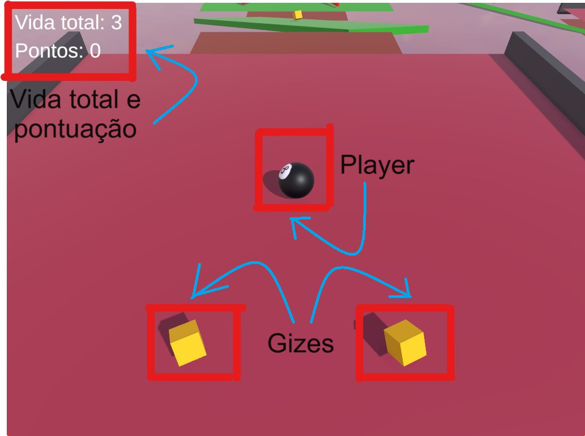
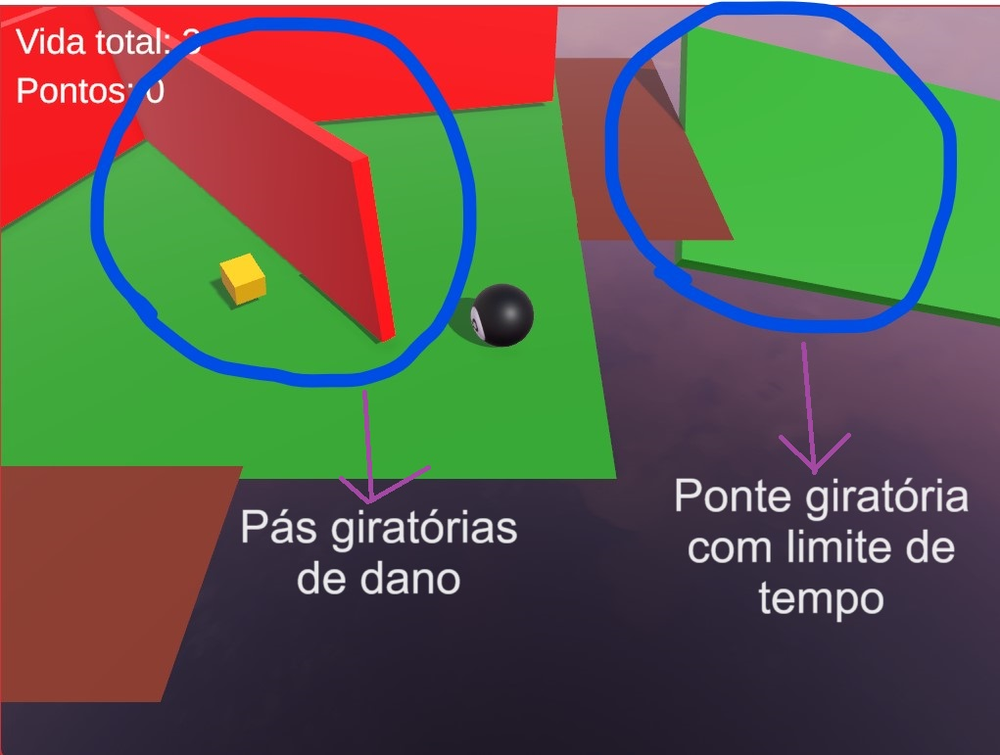
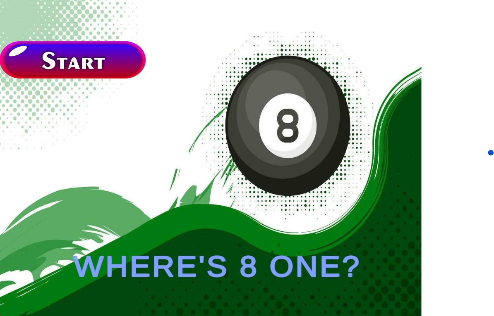
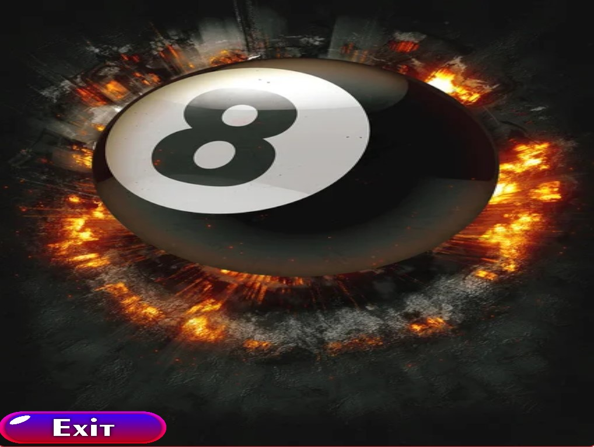
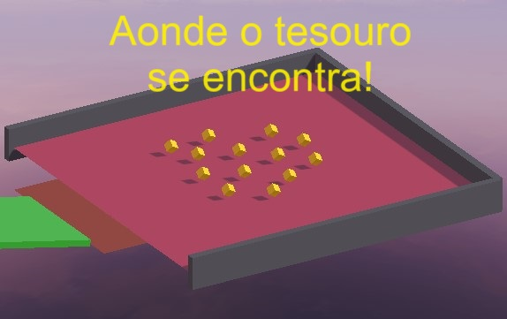

# My_Roll_A_Ball

## Nome do jogo: Where's 8 One?

OBS: códigos utilizados para a criação do jogo estão disponíveis na pasta `Assets/Scripts` ou `Assets\Scenes\`.

Descrição: em um belo dia com sol e nuvens no céu, você iria jogar uma partida de bilhar com seus amigos quando percebe que, ao por as bolas na mesa, a bola 8 sumiu! Quer saber onde ela se encontrava? Jogue e descubra!

No jogo, você irá encontrar os seguintes conteúdos:

É importante saber o que cada elemento representa: você pode ganhar vidas se você coletar gizes (com três gizes, se ganha uma vida), porém, perde uma vida se cair do caminho.

No jogo Where's 8 One?, você vai se deparar com um desafio muito claro: seguir o caminho único até o destino final, onde a bola 8 se encontra com vários gizes a sua espera. No entanto, o trajeto até esse destino pode ser árduo, já que o percurso possui obstáculos e algumas instabilidades, como as seguintes:

A cada vez que a bola 8 encostar em uma das pás, perderá uma vida. Tome cuidado!

O jogo é extremamente intuitivo, também como se observa nas seguintes telas de início de jogo, e tela de Game Over.

### Tela de início

### Tela de Game Over

Por fim, a bola 8 deverá chegar onde ela sempre quis: no paraíso dos gizes!

Não julgue o jogo pela sua simplicidade, pois ele pode ser mais desafiador do que parece. Perdeu três vidas, já era! O jogo acaba e você terá que recomeçar.